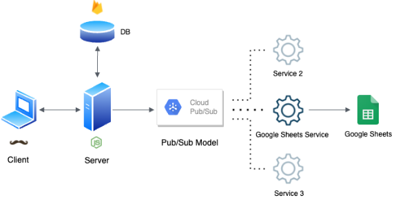
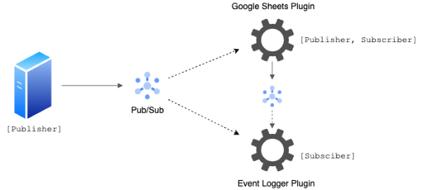
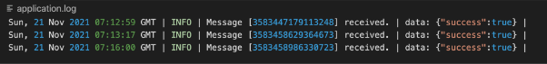

# Atlan-Challenge

**Backend Challenge - Design Specification**

The Atlan Backend Challenge is to design an **ecosystem for integrations** where each use case can be plugged-in without an overhaul on the backend.

**Solution**

I've leveraged the **Pub/Sub event-driven architecture** approach for the solution. The problem statement requires us to create a system that facilitates eventual consistency, fail-safety, high availability, and scalability.

The **Cloud Pub/Sub** by Google that I’ve used in my solution guarantees all of these characteristics. If one of the subscribers/services goes down, the message is retained in the Topic so that once the service is up and running again, the message is delivered to it. This ensures eventual consistency and fail-safely. Also, multiple instances of a service may be deployed and subscribed to a common topic, so if the service fails in any zone, the others can pick up the load automatically. This ensures high availability and reliability.

**Tech stack**

- Node.js, Express, and Handlebars
- Cloud Pub/Sub
- Firebase Cloud Firestore
- Sheets API for implementing one of the services

The architecture of the codebase is shown below:

**In the codebase:**

- **Client:** src/views/\*
- **Server:** src/app.js
- **DB:** src/firebase/firestore.js
- **Publisher:** src/publisher/publisher.js
- **Google Sheets Service:** src/google-sheet-plugin.js

Post-processing business logic has to be performed once the response hits the Collect datastore. An example of the business logic is the Google Sheets use case in which the response has to be added to a Google Sheet once it reaches the datastore. The Pub/Sub model can come in handy here. The central service can act as the publisher of the message once an event likeresponse-added occurs. A service (or plugin) like Google Sheets service can subscribe to the event and operate once the message is published.

Therefore, any number of services or plugins can subscribe to channels in this event-driven plugin system.

To publish the response to a topic:

To subscribe to a topic for the response:

The complete implementation of the Google Sheets use case can be found in src/google-sheet-plugin.js

The fail-safety is inherently present in Cloud Pub/Sub. The published message is stored in the topic until all the subscribed services receive and acknowledge the message. Should a service like Google Sheets service go down, the message is not lost. It are stored in a queue and received once the service is restored. We can also run multiple instances of services to divide the workload, which can be optimized by setting up load balancers.

The following shows the central service publishing two messages to a topic when the Google Sheets service is not running. As one might expect, the service will receive the messages in the same order once it is started.

When the Google Sheets service has not started:

When the Google Sheets service has started:

**Database Schema**

I propose the following **database schema** for storing forms (with questions) and responses (with answers) in the Collect datastore.

This normalized schema makes the database more flexible by eliminating redundancy and data anomalies.

- A **Form** is a collection of Questions and associated Rules.
- A **Question** has a title, description, keyword, question type, and options (if the question type is single-choice or multiple-choice).
- A **Rule** is applied to a Question to validate the incoming responses. The rule, in turn, comprises of Conditions.
- A **Condition** consists of:
- The question on which the condition is applied.
- The type of constraint it applies, such as greater than, less than, is an instance of, etc.
- The value on which the constraint is applied.

*Database Schema*

**Benchmarking**

Pub/Sub Messaging is based on publishers publishing messages and subscribers subscribing to those messages. Thus, it makes sense to **benchmark the system based on publisher and subscriber throughput.**

- **Thread parallelism** can be used to process multiple messages on different cores of the CPU. Since a higher number of generated events can be processed with increased CPU cores, the publisher throughput should increase. Therefore, employing parallelism is an effective strategy to benchmark publisher and subscriber throughput.
- We can publish batches of messages (e.g., 1000 messages or 5 MB per batch). However, large batch settings may increase per-message latency.

**Logging**

Logs are the events that occur during the execution of an application. These events can be errors, warnings, performance metrics, etc.

The logging functionality can also be integrated with the core application using the Pub/Sub architecture without breaking changes. We can create a logging plugin and subscribe it to events emitted by all the other services. In our case, we can subscribe the Event Logging Plugin to the topics where messages are published by the central server and Google Sheets Server. The logs can be written to a log file or stored in a database.

The following is the workflow that I have followed to demonstrate my idea. Please note that I have only subscribed the Event Logging Plugin to the events emitted by the central server in the current codebase. This should suffice the proof of concept.

The implementation of event logging can be found insrc/logger/event-logger.js andsrc/event-logger-plugin.js

**Log format used:**

1. UTC Date and Time
1. Type of the log (Info, Debug, Error)
1. The event that occurred
1. Additional data of the event

**Health monitoring**

Based on the Pub/Sub model, I have come up with the following ideas to monitor the system's health.

1) **To keep the subscribers healthy:**
- **Monitor number of undelivered messages:** The unusually large value of this metric in the context of our system can generate insights into system health. For instance, if the number of undelivered messages grows with time, it can mean that the subscriber is not keeping up with message volume. Adding multiple instances of the subscriber or looking up for bugs in the code that prevent it from successfully acknowledging messages can help solve the issue.
- **Monitor acknowledgement deadline expiration:** A robust Pub/Sub model should allow subscribers a limited amount of time to acknowledge a given message before re-delivering the message. It can be helpful to measure the rate at which subscribers miss the ack deadline. If this rate is high, this could potentially mean:
  - The subscribers are under-provisioned.
  - Each message takes longer to process than the message ack deadline.
  - Some messages consistently crash the client.
- **Monitor forwarded undelivered messages:** If the Pub/Sub service attempts to deliver a message, but the subscriber can’t acknowledge it, Pub/Sub may forward the undeliverable message to another topic (for example, dead-messages topic). The delivery to the “dead-messages” topic would occur only when the limit of delivery attempts to the subscriber is exceeded. The system health can then be analyzed by monitoring the undeliverable messages.
2) **To keep the publishers healthy:**

The channel where the message is published is at the core of the Pub/Sub model. Therefore, it is equally important to ascertain whether the publisher is working as expected. Its performance can be monitored by a kind of **send\_request\_count, grouped by response\_code** metric. This metric will indicate whether the system is healthy and accepting requests by providing the rate of retriable errors.

**Limitations on the Google Sheets API**

There are some limitations on the usage of Sheets API, which can hinder the performance of the Google Sheets plugin.

- Sheets API has a limit of 500 requests per 100 seconds per project and 100 requests per 100 seconds per user.
- It can only be increased to 2500 requests per account even with the paid quota.
- If the Sheets API is down, it means the Google Sheets Plugin cannot function. Even when the service is up, the number of spreadsheets that can be created depends on the membership plan of the Google account. Free Google Accounts give 15 GB of storage.

**Screenshots of the prototype**

